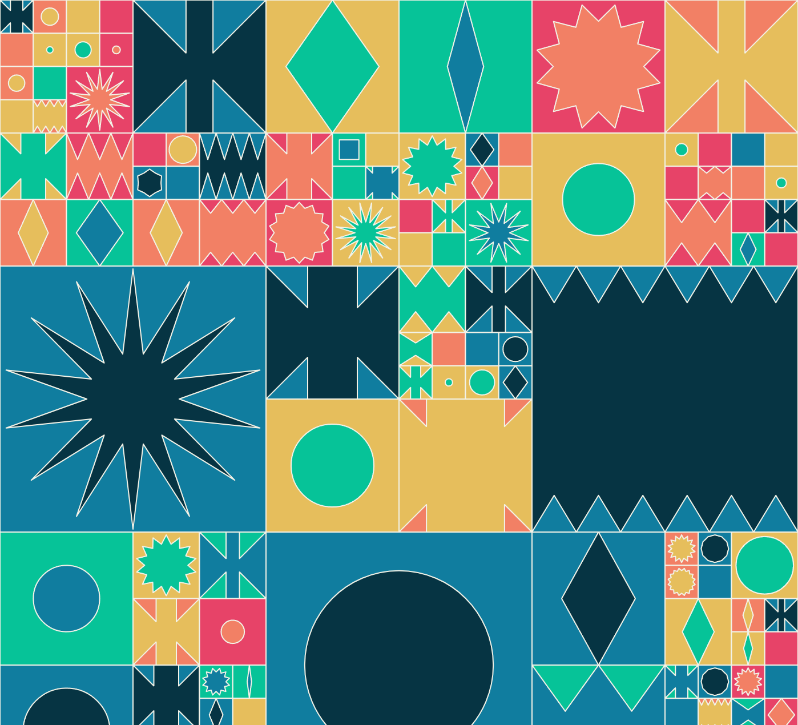

# Geometric Pattern

Draw a grid of squares and within each square a geometric graphic is drawn, ranging from simple shapes such as circles and rhombuses, to more complex shapes such as stars and others that resemble a two-pronged axe and a crown. Elements are randomly filled from a palette of red, yellow, green, pink and black. The internal designs of each square grow and shrink over time.

## License

MIT License

Copyright (c) 2021 Michael Kolesidis
